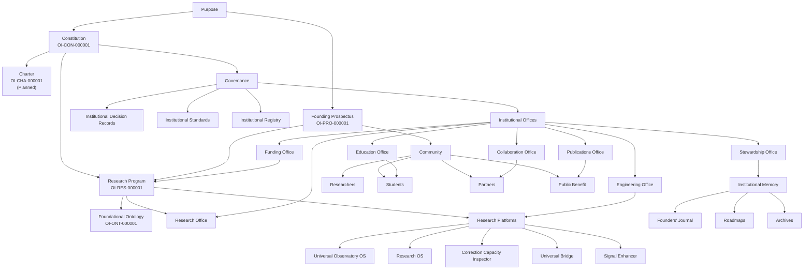

# OI-MAP-000001

# Observatory Institute Institutional Map

**Registry ID**

OI-MAP-000001

---

## Classification

Institutional Architecture Map

---

## Version

0.1

---

## Status

Draft

---

## Date

2026-07-13

---

# Purpose

This map provides a unified view of the Observatory Institute's institutional architecture.

It illustrates how the Institute's purpose, identity, research, governance, operations, platforms, community, and stewardship connect to form a coherent institution.

---

# Institutional Architecture



---

# Four Institutional Pillars

## Knowledge

Research, ontology, evidence, publications, observations, and standards.

---

## Stewardship

Constitution, governance, registry, archives, history, and institutional continuity.

---

## Capability

Research platforms, engineering, infrastructure, software, methods, and tools.

---

## Community

Researchers, students, collaborators, partners, institutions, funders, and the public.

---

# Institutional Flow

```text
Purpose
    |
    v
Constitution
    |
    v
Research and Governance
    |
    v
Offices and Platforms
    |
    v
Artifacts and Community
    |
    v
Public Benefit
    |
    v
Stewardship and Future Observation
```

---

# Foundational Principle

Every institutional artifact should strengthen at least one pillar while preserving the integrity of the others.

---

# Revision Principle

This map is descriptive rather than permanently authoritative.

It will evolve as the Observatory Institute matures.

Every revision shall preserve the previous version through Git history.

---

End of OI-MAP-000001